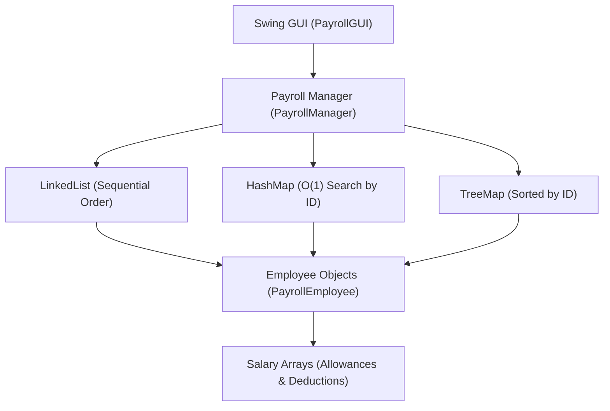

# Employee Payroll Management System using Java

A Java Swing desktop application for managing employee payroll records, calculating allowances, deductions, and net salaries using OOP, Arrays, LinkedList, HashMap, and TreeMap.

---

## 1. Problem Statement

Develop a Java application for managing employee information, departments, salaries, deductions, and net salary. The system enables an organization to maintain employee payroll records and calculate employee salaries through a Swing-based application.

---

## 2. Objectives

1. Manage employee information (ID, Name, Department, Designation, Basic Pay).
2. Calculate employee salary, allowances, and statutory deductions.
3. Represent employees using OOP classes and objects.
4. Use Arrays for storing salary components (HRA, DA, TA, PF, Tax).
5. Use LinkedList for maintaining sequential employee records.
6. Use HashMap for quick O(1) employee ID-based searching.
7. Use TreeMap for sorted employee records by ID.
8. Provide an interactive graphical interface using Java Swing.

---

## 3. Salary Formulas

### Allowances Summation
Total Allowances = Σ(allowances) = HRA + DA + TA
* allowances[0] = HRA (House Rent Allowance)
* allowances[1] = DA (Dearness Allowance)
* allowances[2] = TA (Travel Allowance)

### Deductions Summation
Total Deductions = Σ(deductions) = PF + Tax
* deductions[0] = PF (Provident Fund)
* deductions[1] = Tax (Income Tax)

### Net Salary Calculation
* Gross Salary = Basic Salary + Total Allowances
* Net Salary = Gross Salary - Total Deductions
* Total Organization Payroll = Σ(Net Salary of all employees)

### Quick Example
* Basic Salary = 75,000
* Total Allowances = Σ(15000 + 7500 + 3500) = 26,000
* Gross Salary = 75,000 + 26,000 = 101,000
* Total Deductions = Σ(5000 + 6000) = 11,000
* Net Salary = 101,000 - 11,000 = 90,000

---

## 4. System Architecture



---

## 5. Project Structure

```
.
├── PayrollEmployee.java     # Employee model with arrays and salary logic
├── PayrollManager.java      # Data structures (LinkedList, HashMap, TreeMap)
├── PayrollGUI.java          # Graphical Swing interface
└── README.md                # System documentation
```

---

## 6. Conclusion

This project demonstrates the practical application of core Java data structures (Arrays, LinkedList, HashMap, TreeMap) and Object-Oriented Programming combined with Java Swing to build an organizational payroll management system.

---

## 7. Repository Information

* Repository: [Employee_Payroll_Management_System](https://github.com/prathameshmore07/Employee_Payroll_Management_System)
* Author: Prathamesh More

