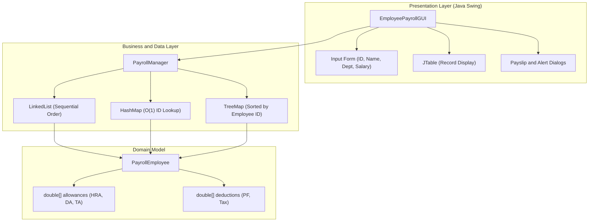
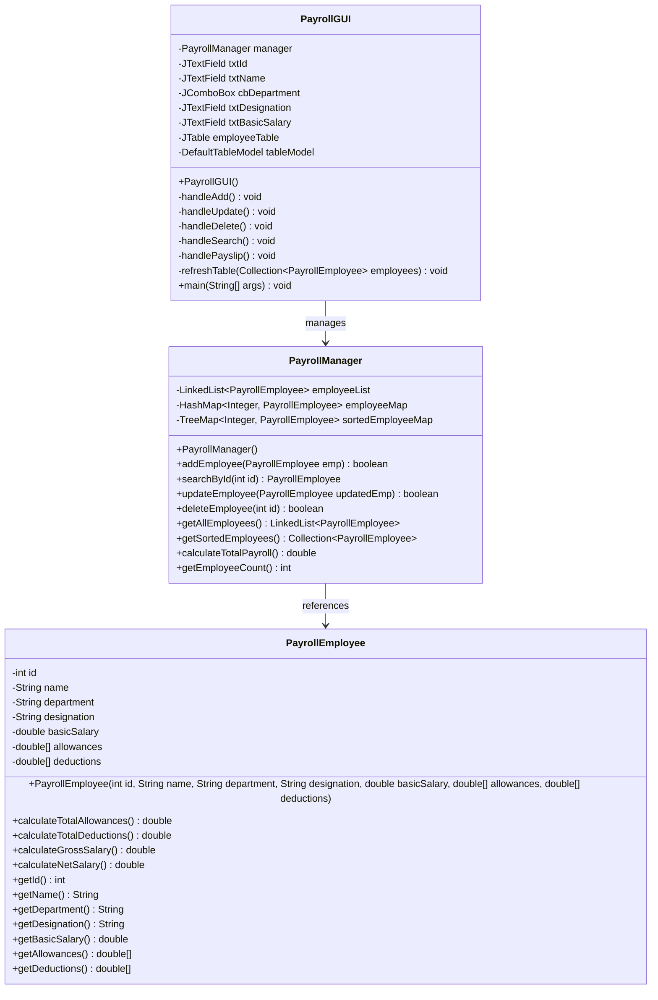
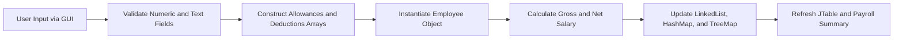

# Employee Payroll Management System

A desktop application developed in Java for managing employee records, departmental allocations, compensation structures, deductions, and net salary calculations. The system incorporates Object-Oriented Programming (OOP) principles, standard Java Collections Framework data structures, and a graphical user interface implemented via Java Swing.

---

## 1. Problem Statement

Organizations require a structured, automated approach to track employee details, compute allowances and statutory deductions, and generate accurate salary records. This application provides a Swing-based interface that maintains employee records using appropriate in-memory data structures (`LinkedList`, `HashMap`, `TreeMap`, and fixed-size arrays) to support efficient insertion, search, sorting, and reporting.

---

## 2. System Architecture

The application adopts a modular, layered architecture separating user interface presentation, business logic/data management, and domain models.



---

## 3. Class Diagram



---

## 4. Objectives and Implementation Details

| Objective | Requirement | Implementation in Code |
| :--- | :--- | :--- |
| **1** | Manage employee information | Fields for ID, Name, Department, Designation, and Basic Salary in `PayrollEmployee.java`. |
| **2** | Calculate employee salary and deductions | Methods `calculateTotalAllowances()`, `calculateTotalDeductions()`, and `calculateNetSalary()`. |
| **3** | Represent employees using OOP | Encapsulated entity class `PayrollEmployee` with accessors, mutators, and business logic. |
| **4** | Use arrays for salary components | `double[] allowances` (index 0: HRA, index 1: DA, index 2: TA) and `double[] deductions` (index 0: PF, index 1: Tax). |
| **5** | Use LinkedList for records | `LinkedList<Employee> employeeList` preserves chronological insertion sequence. |
| **6** | Use HashMap for ID searching | `HashMap<Integer, Employee> employeeMap` provides constant-time $O(1)$ query capability. |
| **7** | Use TreeMap for sorted records | `TreeMap<Integer, Employee> sortedEmployeeMap` ensures automatic ordering by Employee ID. |
| **8** | Provide graphical interface | Desktop GUI implemented using Java Swing (`JFrame`, `JTable`, `JPanel`, `JButton`, `JOptionPane`). |
| **9** | Implement CRUD operations | Full support for Create (Add), Read (Search/View All/View Sorted), Update, and Delete. |
| **10** | Verify calculations and records | Comprehensive automated test suite in `PayrollTest.java`. |

---

## 5. Payroll Processing Workflow



---

## 6. Compensation and Deduction Mathematical Model

The salary computation follows standard payroll formulation:

$$\text{Gross Salary} = \text{Basic Salary} + \sum_{i=0}^{n-1} \text{allowances}[i]$$

$$\text{Total Deductions} = \sum_{j=0}^{m-1} \text{deductions}[j]$$

$$\text{Net Salary} = \text{Gross Salary} - \text{Total Deductions}$$

Where:
* `allowances[0]` = House Rent Allowance (HRA)
* `allowances[1]` = Dearness Allowance (DA)
* `allowances[2]` = Travel Allowance (TA)
* `deductions[0]` = Provident Fund (PF)
* `deductions[1]` = Professional / Income Tax

---

## 7. Directory Structure

```
mini project/
├── PayrollEmployee.java     # Employee model with arrays and salary calculations
├── PayrollManager.java      # Data structures (LinkedList, HashMap, TreeMap)
├── PayrollGUI.java          # Graphical Swing interface
└── README.md                # System documentation
```

---

## 8. How to Compile and Run

### Prerequisites
* Java Development Kit (JDK) 17 or higher.

### Step 1: Compile the Code
Run this command from your terminal:
```bash
javac "mini project"/*.java
```

### Step 2: Run the Application
Launch the graphical interface:
```bash
java -cp "mini project" PayrollGUI
```

---

## 9. Conclusion

This project integrates core Java competencies:
* **Object-Oriented Programming**: Data hiding, parameterized constructors, and entity encapsulation.
* **Primitive Arrays**: Fixed-size arrays for component-based compensation modeling.
* **Java Collections Framework**: Practical trade-offs between sequential traversal (`LinkedList`), constant-time search (`HashMap`), and balanced tree ordering (`TreeMap`).
* **Desktop Application Development**: Event-driven programming and layout management using Java Swing.
